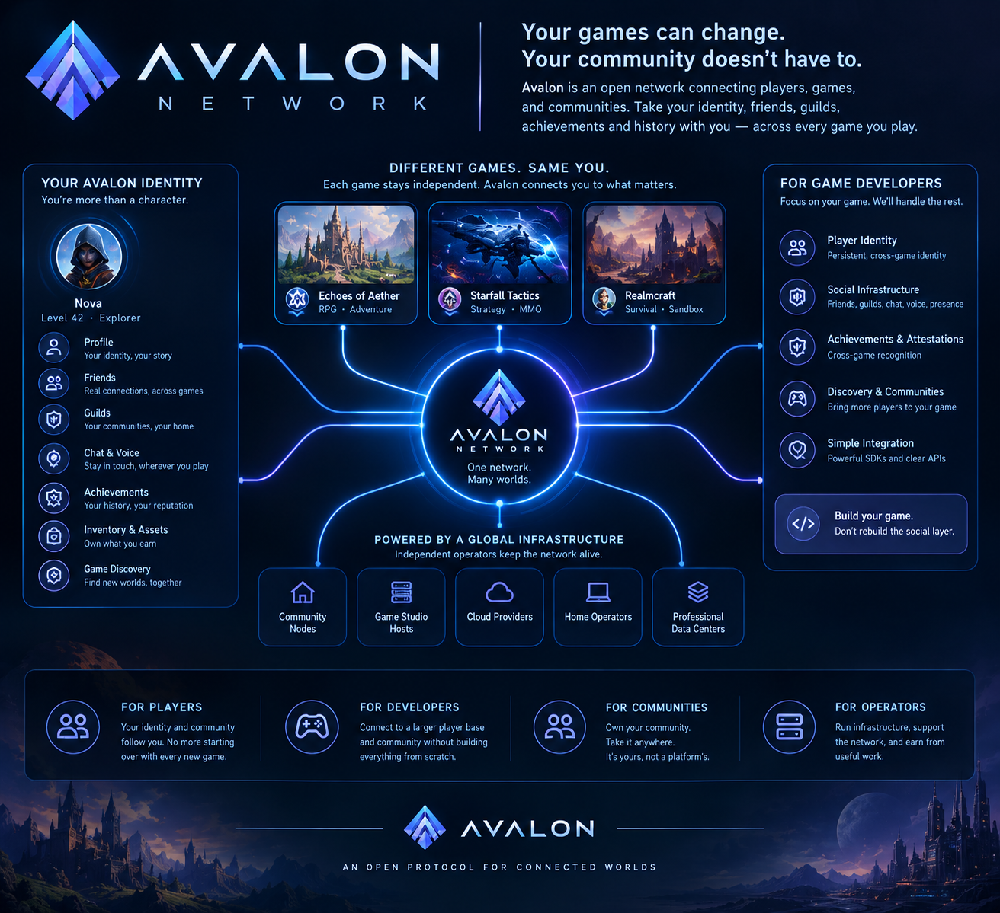

<p align="center">
  <a href="LICENSE"></a>
  
</p>

# Avalon Protocol

Avalon Protocol is an open, self-hostable identity and social layer: one
persistent identity, one friends list, one history of guilds and
achievements, that a person carries between every game, app, and service
that opts into the network — owned by them, not any single integrator. Build
on it and your users bring a real identity and community with them instead
of starting from zero; opt into it and your product gets a working friends
list, presence, guild membership, and chat backend for free — Avalon runs
that infrastructure, you wire your client to the SDK and put your own UI on
top of it, not build and operate the backend yourself.

**In gaming**, this is the clearest and first use case: who your friends
are, what guild you're in, the achievements you've earned, none of it
should reset to zero at every new game, trapped in whichever studio's
database happens to run that title. Avalon carries a player's identity,
friends, guild membership, and achievement history between the games that
opt into the network. Gaming is where the idea started and where it's
furthest along today — the same layer works for any app or service that
wants persistent identity and community without owning it outright.

## Why Avalon

Games are where the idea is proven out first:

> **Games are experiences. Your identity, friends, guilds, achievements, and
> history belong to you.**

- **Identity is separate from characters.** One persistent identity, any number of
  unrelated characters across games.
- **Interoperability is opt-in.** A game chooses which Avalon capabilities it wants
  (identity, guilds, achievements, ...) and which other issuers' attestations it
  trusts. Nothing is forced.
- **Least privilege by default.** A game receives only the capabilities a user
  has explicitly granted — never blanket access to an identity's whole history.
- **History is verifiable, not just shared.** Achievements are signed attestations
  a receiving game can independently verify and decide whether to trust — not
  arbitrary rows in someone else's database.
- **Settlement is a public transparency log, not federation or blockchain consensus.**
  Durable facts are independently verifiable and mirrorable by anyone, and
  consensus is a permissioned validator set reaching agreement — not mining
  or a stake-weighted token.
- **Don't build the universe.** Avalon is the railroad between games, not another
  platform trying to own every destination — a game stays fully sovereign over
  its own world, economy, and rules.

Tools already exist that solve part of this problem — Discord is the clearest
example, with one identity, one friends list, and presence that spans every
game you play. What none of them give you is anything a game can actually
build on: an achievement a game can issue and another can independently
verify, or a social graph a user actually owns in a portable sense rather
than one that belongs to whichever platform happens to host it. Avalon isn't
a competitor to Discord or Slack — it's the open identity and social layer
underneath, that any of them could plug into as a client, the same way a
game or the Hub app can. See [Why Avalon](docs/WhyAvalon.md) for the full
argument.

## Screenshots

<p align="center">
  
</p>

The Hub — Avalon's web client for identity, friends, guilds, and
achievements — is real and working, not a mockup; UI screenshots are coming
as its surface stabilizes. In the meantime, see the network model above.

## Getting Started

```bash
docker compose up -d && cp .env.compose.example .env
make migrate && make start
make create-identity && make inspect-ledger
```

See the [local development guide](docs/maintainers/local-development.md)
for the full setup path (prerequisites, the Hub web client, Storybook, the
C# SDK, resetting the database, and running the live test suite).

## What can I build with it?

- Give a game, app, or service a persistent player identity — a
  self-custodied keypair, not another studio-owned account — with WebAuthn
  passkey login and Ed25519 event signing, wired through
  `avalon create-identity` or any official SDK.
- Carry a friends list, presence, and guild membership between unrelated
  integrators, without either one trusting the other's database directly.
- Skip building your own friends list, presence, or guild chat backend —
  Avalon already runs it. Wire the SDK to it and put your own UI on top;
  you're not standing up servers, storage, or delivery for any of it.
- Issue an achievement or attestation your integrator vouches for, that
  another can independently verify without taking your word for it.
- Stand up your own `avalon-server` node — the network is self-hostable, not
  a single company's service you have to depend on.
- Build a client entirely on the [official SDKs](docs/projects/sdks/README.md)
  without touching this repo's own apps.

```text
crates/
  protocol/   pure domain types & traits — identity, guilds, achievements, events;
              also owns Signed Tree Head signing/verification
  chain/      SettlementProvider trait + ledger implementation (not a blockchain yet)
  indexer/    fast-read query layer, rebuildable from durable protocol events
  server/     the network-facing API/auth service every client talks to
  cli/        local dev/ops tooling (`avalon` binary)
  devenv/     loads the workspace root's .env from a fixed path
```

The Hub client applications (web app and the Tauri desktop/mobile app) live in
[`avalon-hub`](https://github.com/avalon-initiative/avalon-hub).

Every official SDK (Rust, C#, TypeScript) lives in a separate `avalon-sdks`
repository rather than in this workspace; see the
[Rust](docs/projects/sdks/rust/README.md),
[C#](docs/projects/sdks/csharp/README.md), and
[TypeScript](docs/projects/sdks/typescript/README.md) SDK docs.

## Trusted networks


`network_id` (e.g. `avalon-dev-local`, `avalon-mainnet-1`) is a plain string
with zero cryptographic authority on its own — anyone can stand up a server
and claim the same one. The table below is Avalon's actual root of trust: it
pins each known network's `network_id` to the settlement operator's real
Ed25519 public key, so a client can verify a server's Signed Tree Heads
(`GET /ledger/sth/latest`) instead of trusting the name alone. This table is
rendered from [`docs/trusted-networks.json`](docs/trusted-networks.json), the
single canonical copy — not a hand-maintained duplicate, and a Hub test fails
if the two ever drift. See
[Network trust anchors](docs/projects/backend-server/architecture/network-trust-anchors.md)
for the full model, how the Hub enforces it, and what this deliberately does
not solve (a compromised maintainer publishing a bad key here is a
governance problem, not one client-side pinning can fix).

| Label | `network_id` | STH verify key (Ed25519, hex) |
|---|---|---|
| `avalon-dev-local` *(local-dev — no real deployment yet, see notes below)* | `avalon-dev-local` | `bbcb11ead3d7c68d58ddf0f923df6e7e8347a4341e93eb7b07c3c7a2622accd7` |

This repo has no publicly deployed Avalon network yet, so the entry above is
a template: a real, freely-generated Ed25519 key with no server behind it,
checked in so the pinning mechanism is exercised end to end rather than left
as an unfilled stub. Adding a real network means appending its `network_id`
and the actual hex from that deployment's `AVALON_SETTLEMENT_VERIFY_KEY`
(see `.env.example`) to `docs/trusted-networks.json`. Three deployment tiers
are supported — `avalon-dev-<name>` (single-node), `avalon-int-<name>` (a
1-5 node interconnected test bed for verifying changes integrate before
mainnet), and `avalon-mainnet-N` (the real, independently growing/shrinking
validator set) — see the
[trust anchor list](docs/projects/backend-server/architecture/network-trust-anchors.md#the-trust-anchor-list)
for what each tier's `environment` value means.

Avalon Hub bundles this same list at build time and always shows which
pinned network the current session is connected to, flagging a mismatch or
an unpinned network rather than trusting it silently — see
`avalon-hub/apps/hub/src/network/`.

## Learn more

[Doc map](docs/README.md) · [Glossary](docs/GLOSSARY.md) · [Proposal](docs/stakeholders/Proposal.md) · [Architecture](docs/projects/backend-server/architecture/README.md) · [Why Avalon](docs/WhyAvalon.md)

## Contributing

Opening a PR here makes you part of the Avalon Initiative, not an outside
contributor to somebody else's project — the same standard every operator
and integrator on this network is held to. Every proposal is checked against
one question: does it keep a game fully sovereign over its own world, giving
Avalon only the connective infrastructure between games, never authority
over any single one? See [Contributing](.github/CONTRIBUTING.md) for the
branch/PR workflow and the full feature proposal gate.

## FAQ

**Is there a token, or is this a blockchain?** No. No native currency at
launch — a cross-game currency layer is an explicitly later, optional phase
if ever proposed on its own merits. Settlement is a signed, append-only
transparency log with a permissioned validator set reaching agreement, not
mining or a stake-weighted token.

**Who owns my identity and data?** You do. An identity is a self-custodied
keypair — a WebAuthn passkey for login plus a separate Ed25519 key that
signs the events you author — not an account any company controls.

**Does a game have to expose everything to join the network?** No.
Interoperability is opt-in per capability (identity, friends, guilds,
achievements, ...), and a game decides which other issuers' attestations it
trusts. Avalon never dictates a game's character model, economy, or rules.

**Can I run my own node?** Yes — Avalon is self-hostable, not a single
company's service. See the [hosting docs](docs/projects/backend-server/for-hosters/README.md)
to stand one up, and the [upgrade guide](docs/projects/backend-server/for-hosters/upgrading.md)
for rolling out new versions and security patches to one already running.

**Is it stable enough for production?** Avalon is pre-release. The core
vertical slice (identity/auth, social graph, guilds, achievements/
attestations) runs end to end against a live Postgres instance, not
scaffolding — see the [architecture docs](docs/projects/backend-server/architecture/)
for the current state of each area, one file per topic — but no network has
publicly launched yet.

<!--
## Related projects

TODO: once the backend, SDKs, Hub, and hub-app split into their own
repositories, list them here.
-->

## Support the project

<a href="https://www.buymeacoffee.com/lunarvagabond" target="_blank"></a>

## License

Apache-2.0 — see [LICENSE](LICENSE).
