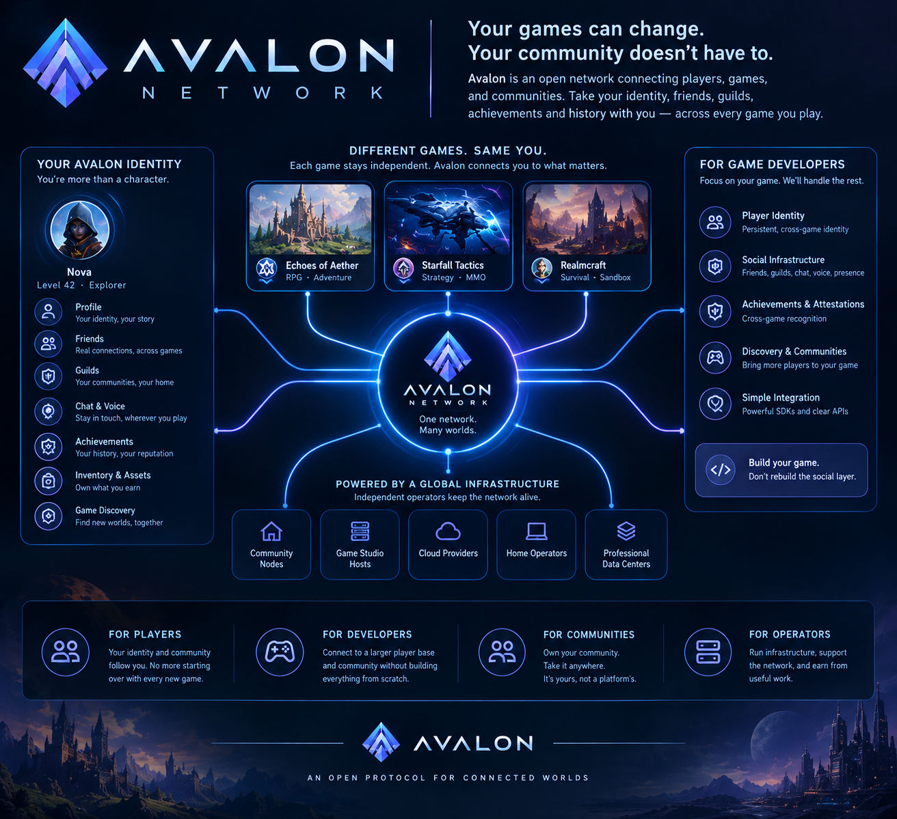

  

# Documentation for this repository

Documentation about Avalon as a whole (what it is, how it works, how the projects relate, the protocol
concepts, architecture, integration, and the architectural decisions) lives in the
**[`avalon-docs`](https://github.com/avalon-initiative/avalon-docs)** repository. That is the canonical
starting point. Nothing under this directory is authoritative for how Avalon works.

This directory holds only what is specific to building, running, and operating this implementation:

| I want to... | Go to |
|---|---|
| Learn what Avalon is and how it works | [`avalon-docs`](https://github.com/avalon-initiative/avalon-docs) |
| Set up a development environment, run the live tests | [`maintainers/local-development.md`](maintainers/local-development.md) |
| Contribute to this repository | [`maintainers/README.md`](maintainers/README.md) and [`../.github/CONTRIBUTING.md`](../.github/CONTRIBUTING.md) |
| Stand up and operate an `avalon-server` node | [`projects/backend-server/for-hosters/`](projects/backend-server/for-hosters/README.md) |
| Run maintainer procedures (key rotation, releases, witness drills, equivocation response) | [`projects/backend-server/for-maintainers/`](projects/backend-server/for-maintainers/) |
| Use the `avalon` CLI | [`projects/cli/README.md`](projects/cli/README.md) |
| Integrate with an SDK | [`avalon-sdks`](https://github.com/avalon-initiative/avalon-sdks/tree/main/docs) and the [SDK docs](https://github.com/avalon-initiative/avalon-docs/blob/main/sdk/README.md) |

## Machine-read files

- [`generated/openapi.json`](generated/openapi.json) is the OpenAPI document generated from the server's routes (`make openapi`). The SDKs are generated from it.
- [`trusted-networks.json`](trusted-networks.json) is the pinned trust-anchor list the SDKs fetch at runtime by its path in this repository. Do not move or rename it.

## Where things belong

- **How Avalon works** (concepts, invariants, protocol behavior, cross-project design): [`avalon-docs`](https://github.com/avalon-initiative/avalon-docs).
- **How this repository implements it** (crate layout, environment variables, local setup, testing, operations runbooks): here.

When both need a mention, the explanation lives in `avalon-docs` and the page here links to it.
