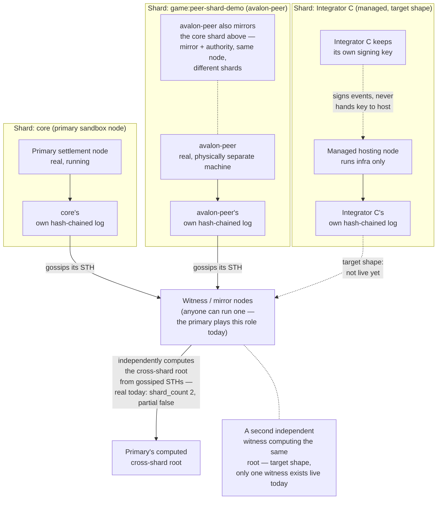
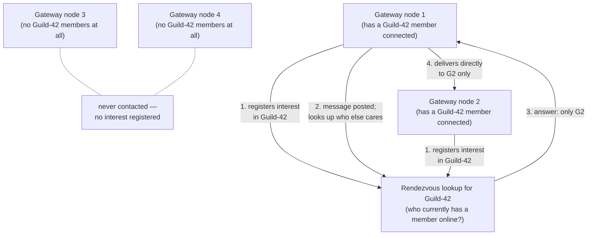

# Distributed Topology (Target Shape)

**Section 1 (Settlement) is now real, not just target shape** — as of
2026-09-17 a genuine second settlement shard runs on a physically separate
machine (`avalon-peer`), proving #527/#529/#532/#543 compose end to end
across real hardware, not just local processes sharing one Postgres. See
each diagram's own "Today in the repo" note below for exactly what's live
versus still design. **Section 2 (Realtime) is still target shape** — one
in-process broadcast channel today, no cross-node interest routing yet.
This document exists so the multi-shard, multi-node, interest-routed
direction decided across
[#527](https://github.com/LunarVagabond/avalon-protocol/issues/527),
[#535](https://github.com/LunarVagabond/avalon-protocol/issues/535), and
[#542](https://github.com/LunarVagabond/avalon-protocol/issues/542) has one
consistent picture everyone can build against, instead of a different
mental model per conversation. Treat every diagram below as directional —
several pieces (marked below) are explicitly still open questions, not
settled implementation plans.

## Two separate meshes, one network

Avalon has two independent distributed problems, kept deliberately apart —
the same hot/durable split the rest of the architecture already uses
([overview.md](overview.md)):

1. **Settlement** — durable, infrequent, cryptographically verified facts.
   Sharded by *authority* (who's allowed to write it), not by load.
2. **Realtime** — frequent, ephemeral-to-warm, never cryptographically
   verified. Routed by *interest* (who's currently listening), not by
   authority.

They never share a mechanism. A node can run either, both, or neither.

## 1. Settlement: sharded authority, no designated aggregator

**Real as of 2026-09-17, not just this diagram's target shape** — the two
shards below are the primary sandbox node (`core`) and `avalon-peer`, a
physically separate machine that mirrors `core` *and* independently
authors its own real `game:...` shard with its own registered
`shard_settlement` key. This is the smallest possible live instance of the
picture: two shards, one witness (the primary, computing the cross-shard
root over both). Nothing here is simulated or run as two local processes
sharing one Postgres — see [settlement.md](settlement.md)'s "Cross-machine,
real end to end" section for the exact proof.

- Each shard is authoritative for its own events only — one legitimate
  signer per shard, so there's still nothing to referee (`ADR #186`'s
  reasoning is unchanged, just applied per-shard instead of network-wide).
- **No node "does the gluing."** The cross-shard root is a fixed, public
  recipe over gossiped shard STHs — any witness computes the identical
  result independently. Losing any one witness changes nothing; there is
  no privileged aggregator role to lose. Today only one witness (the
  primary) actually computes it live — the "no privileged aggregator"
  property is a design invariant of the recipe itself, not yet proven by
  running a second, independent witness that agrees.
- A shard operator can be the integrator itself, or a managed host running
  infrastructure on the integrator's behalf — the signing key never
  leaves the integrator either way (`#531`, still design-only, not the
  live `avalon-peer` shard above which is self-hosted directly).
- A witness's check step above isn't just "does the math match" — it
  also confirms each contributing shard's STH is signed by a key actually
  authorized for that shard (`#543`,
  [`./network-trust-anchors.md`](./network-trust-anchors.md)'s "Per-shard
  trust anchors" section), catching a consistent-but-unauthorized shard,
  not just a math error. This check is real and live-verified, not
  simulated — `avalon-peer`'s shard STH is resolved and checked against
  its actual DB-registered key.
- A single node can hold **both** roles at once for **different** shards —
  `avalon-peer` above mirrors `core` while authoring its own shard. See
  [nodes.md](nodes.md)'s "A node's three configuration axes are
  independent" section; this used to be a real bug (#573) before every
  `/ledger/*` read became shard-scoped.
- Tracked by: [#528](https://github.com/LunarVagabond/avalon-protocol/issues/528)
  epic (all sub-issues implemented and merged except #544), sub-issues
  [#529](https://github.com/LunarVagabond/avalon-protocol/issues/529)–[#533](https://github.com/LunarVagabond/avalon-protocol/issues/533),
  [#543](https://github.com/LunarVagabond/avalon-protocol/issues/543).

## 2. Realtime: interest-scoped mesh, not full broadcast

- A node never needs a directory of every other node on the network — only
  how to reach the rendezvous lookup for a given guild/conversation, plus
  whichever peers it's actively exchanging events with right now.
- Delivery cost scales with how spread out *that guild* actually is, never
  with total network size — a network with millions of nodes and a guild
  with 5 online members costs the same as a small network with the same
  5 members.
- **Decided (#542, closed): a libp2p Kademlia DHT (`rust-libp2p`'s `kad`
  module) is the rendezvous lookup**, not a Redis-backed node per region
  or any other single-box design — the "avoids becoming a new single
  point of failure" requirement above is answered by kad's own
  replication (a record lives on the several nodes closest to its key,
  not one operator-chosen box), the production-proven approach IPFS/
  Filecoin/Ethereum already use for the same problem. Tracked as epic
  [#580](https://github.com/LunarVagabond/avalon-protocol/issues/580).
  A node's `PeerId`/bootstrap into the DHT (`crate::dht`) is real, live-
  verified across the two-node LAN sandbox (#582); registering/looking up
  interest itself (`crate::interest`, "registers interest"/"looks up who
  else cares" in the diagram above) is also real and live-verified —
  `crate::interest::run_worker` re-puts a `PutRecord` under a hash of the
  guild-channel/conversation id for as long as a local subscriber exists,
  a lookup is a `GetRecord` against that same key (#583). **Not yet
  wired into actual relay decisions** — `crate::realtime_relay` still
  does today's full peer-table loop below; re-scoping it to call
  `interest::lookup` instead is #584, still open.
- Today's actual relay implementation (`#539`) is the small-mesh
  degenerate case of this picture: full broadcast to a full peer table,
  correct for a handful of nodes, explicitly flagged as not the end
  state — see the #584 note just above for what replaces it.
- Tracked by: [#538](https://github.com/LunarVagabond/avalon-protocol/issues/538)
  epic (implementation), [#542](https://github.com/LunarVagabond/avalon-protocol/issues/542)
  (the interest-scoping decision this section describes), [#362](https://github.com/LunarVagabond/avalon-protocol/issues/362)/[#292](https://github.com/LunarVagabond/avalon-protocol/issues/292)
  (today's small-mesh peer table).

## Today in the repo

- Section 1 is real: two independent settlement authorities exist today
  (the primary's `core` shard, `avalon-peer`'s `game:...` shard), on two
  physically separate machines, with the primary computing a real
  cross-shard root over both. What's still missing versus the full target
  picture: only one witness exists (no second, independent witness has
  been stood up to *prove* agreement rather than just compute it once),
  and the managed-hosting shard (subgraph C above) is design-only (#531).
  See [settlement.md](settlement.md) and [nodes.md](nodes.md) for the
  current, honest state and exact live numbers.
- Realtime fan-out is one in-process `tokio::broadcast` channel
  (`crates/server/src/presence.rs`/`crates/server/src/chat.rs`) fanned out
  cross-node by `crate::realtime_relay`'s full-peer-table loop (#539) —
  real, but not yet interest-scoped. Section 2's actual interest-scoped
  mesh is now partly real: DHT bootstrap (#582) and the interest
  registration/lookup primitive itself (#583) both work, live-verified;
  `realtime_relay` calling that lookup instead of looping every peer is
  #584, still open.
- This document itself is new (filed alongside
  [#527](https://github.com/LunarVagabond/avalon-protocol/issues/527)/[#535](https://github.com/LunarVagabond/avalon-protocol/issues/535)/[#542](https://github.com/LunarVagabond/avalon-protocol/issues/542))
  and will drift out of date as those tickets land — treat the linked
  issues as the source of truth for anything this page doesn't cover, the
  same convention every other document in this directory follows.

## Decisions and tickets

- [#527](https://github.com/LunarVagabond/avalon-protocol/issues/527) —
  decided: sharded settlement authority, no consensus, deterministic
  cross-shard root
- [#535](https://github.com/LunarVagabond/avalon-protocol/issues/535) —
  decided: one-hop realtime relay (small-mesh case), async at-rest
  replication, failover as a consequence
- [#542](https://github.com/LunarVagabond/avalon-protocol/issues/542) —
  decided (closed): interest-scoped routing and peer discovery at real
  scale via a libp2p Kademlia DHT — see section 2 above for the current
  implementation state (epic #580)
- [ADR #186](https://github.com/LunarVagabond/avalon-protocol/issues/186) —
  no validator/consensus layer; still the reasoning both meshes rely on
- [#70](https://github.com/LunarVagabond/avalon-protocol/issues/70) —
  mirrors, not federation; section 1's witness model extends this directly
