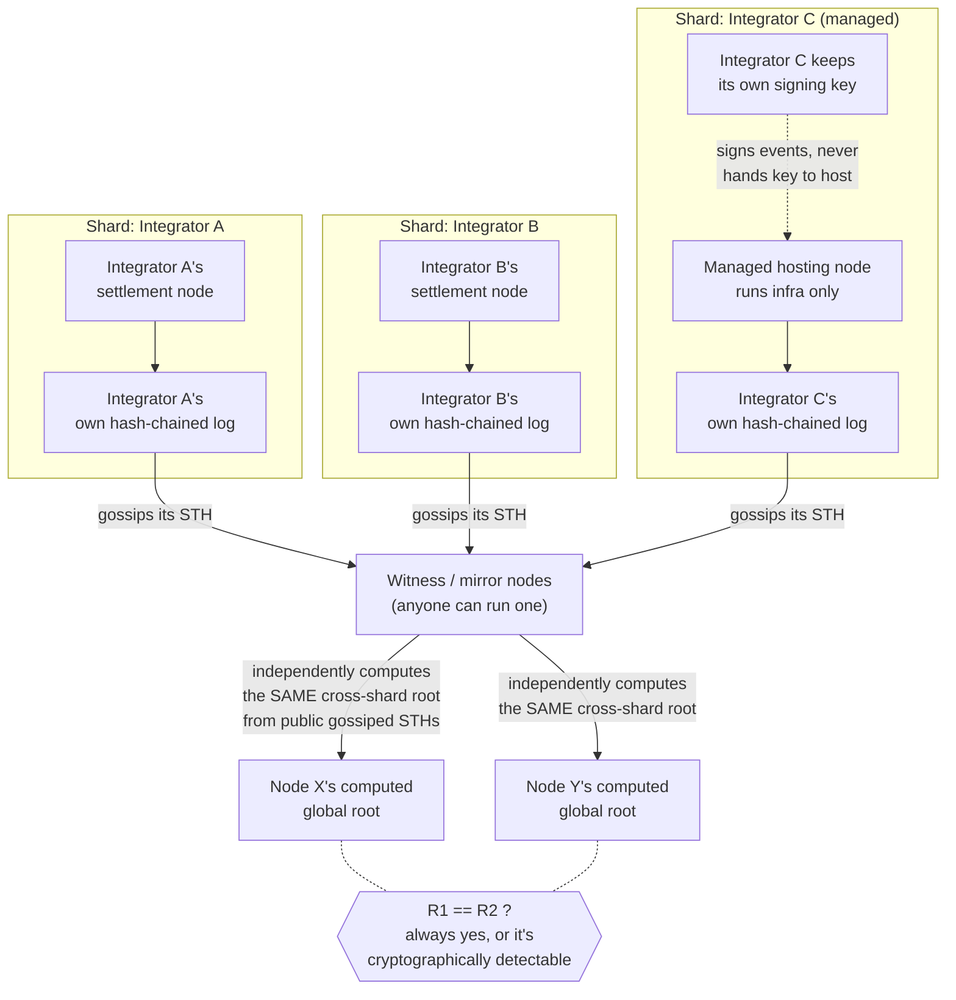
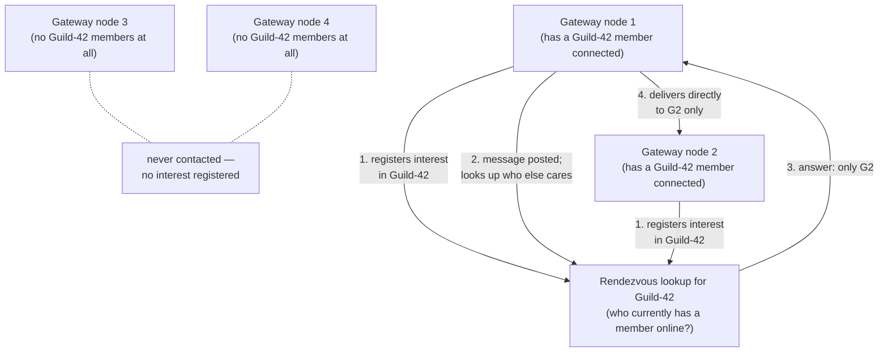

# Distributed Topology (Target Shape)

**This is where the network is designed to end up, not what runs today.**
Milestone 1 is one `avalon-server` process, one Postgres database, one
settlement authority (see each linked doc's own "Today in the repo"
section for the honest current state). This document exists so the
multi-shard, multi-node, interest-routed direction decided across
[#527](https://github.com/LunarVagabond/avalon-protocol/issues/527),
[#535](https://github.com/LunarVagabond/avalon-protocol/issues/535), and
[#542](https://github.com/LunarVagabond/avalon-protocol/issues/542) has one
consistent picture everyone can build against, instead of a different
mental model per conversation. Treat every diagram below as directional —
several pieces (marked below) are explicitly still open questions, not
settled implementation plans.

## Two separate meshes, one network

Avalon has two independent distributed problems, kept deliberately apart —
the same hot/durable split the rest of the architecture already uses
([overview.md](overview.md)):

1. **Settlement** — durable, infrequent, cryptographically verified facts.
   Sharded by *authority* (who's allowed to write it), not by load.
2. **Realtime** — frequent, ephemeral-to-warm, never cryptographically
   verified. Routed by *interest* (who's currently listening), not by
   authority.

They never share a mechanism. A node can run either, both, or neither.

## 1. Settlement: sharded authority, no designated aggregator

- Each shard is authoritative for its own events only — one legitimate
  signer per shard, so there's still nothing to referee (`ADR #186`'s
  reasoning is unchanged, just applied per-shard instead of network-wide).
- **No node "does the gluing."** The cross-shard root is a fixed, public
  recipe over gossiped shard STHs — any witness computes the identical
  result independently. Losing any one witness changes nothing; there is
  no privileged aggregator role to lose.
- A shard operator can be the integrator itself, or a managed host running
  infrastructure on the integrator's behalf — the signing key never
  leaves the integrator either way (`#531`).
- A witness's `Check` step above isn't just "does the math match" — it
  also confirms each contributing shard's STH is signed by a key actually
  authorized for that shard (`#543`,
  [`./network-trust-anchors.md`](./network-trust-anchors.md)'s "Per-shard
  trust anchors" section), catching a consistent-but-unauthorized shard,
  not just a math error.
- Tracked by: [#528](https://github.com/LunarVagabond/avalon-protocol/issues/528)
  epic, sub-issues
  [#529](https://github.com/LunarVagabond/avalon-protocol/issues/529)–[#533](https://github.com/LunarVagabond/avalon-protocol/issues/533),
  [#543](https://github.com/LunarVagabond/avalon-protocol/issues/543).

## 2. Realtime: interest-scoped mesh, not full broadcast

- A node never needs a directory of every other node on the network — only
  how to reach the rendezvous lookup for a given guild/conversation, plus
  whichever peers it's actively exchanging events with right now.
- Delivery cost scales with how spread out *that guild* actually is, never
  with total network size — a network with millions of nodes and a guild
  with 5 online members costs the same as a small network with the same
  5 members.
- **Open, not yet decided:** what actually implements the rendezvous
  lookup and the interest registry (a Redis-backed node per region/shard
  is one candidate raised in discussion, not settled), and — critically —
  **how that lookup itself avoids becoming a new single point of failure.**
  If "who's interested in Guild-42" lives on exactly one box, losing that
  box silently breaks delivery for every guild it was tracking, which is
  the same class of mistake this whole redesign exists to avoid. Whatever
  answers this must itself be mirrored to more than one node — the exact
  mechanism is genuinely open, tracked in
  [#542](https://github.com/LunarVagabond/avalon-protocol/issues/542).
- Today's actual implementation (`#539`) is the small-mesh degenerate case
  of this picture: full broadcast to a full peer table, correct for a
  handful of nodes, explicitly flagged as not the end state.
- Tracked by: [#538](https://github.com/LunarVagabond/avalon-protocol/issues/538)
  epic (implementation), [#542](https://github.com/LunarVagabond/avalon-protocol/issues/542)
  (the interest-scoping decision this section describes), [#362](https://github.com/LunarVagabond/avalon-protocol/issues/362)/[#292](https://github.com/LunarVagabond/avalon-protocol/issues/292)
  (today's small-mesh peer table).

## Today in the repo

- Exactly one settlement authority exists (`avalon-server`, one Postgres).
  Nothing described in section 1 is implemented yet — see
  [settlement.md](settlement.md) and [nodes.md](nodes.md) for the current,
  honest state.
- Realtime fan-out is one in-process `tokio::broadcast` channel
  (`crates/server/src/presence.rs`) — it does not cross process boundaries
  at all today, let alone route by interest. Section 2's "small-mesh
  degenerate case" isn't built yet either; it's the near-term target for
  [#539](https://github.com/LunarVagabond/avalon-protocol/issues/539).
- This document itself is new (filed alongside
  [#527](https://github.com/LunarVagabond/avalon-protocol/issues/527)/[#535](https://github.com/LunarVagabond/avalon-protocol/issues/535)/[#542](https://github.com/LunarVagabond/avalon-protocol/issues/542))
  and will drift out of date as those tickets land — treat the linked
  issues as the source of truth for anything this page doesn't cover, the
  same convention every other document in this directory follows.

## Decisions and tickets

- [#527](https://github.com/LunarVagabond/avalon-protocol/issues/527) —
  decided: sharded settlement authority, no consensus, deterministic
  cross-shard root
- [#535](https://github.com/LunarVagabond/avalon-protocol/issues/535) —
  decided: one-hop realtime relay (small-mesh case), async at-rest
  replication, failover as a consequence
- [#542](https://github.com/LunarVagabond/avalon-protocol/issues/542) —
  open: interest-scoped routing and peer discovery at real scale,
  including the still-unresolved rendezvous-availability question above
- [ADR #186](https://github.com/LunarVagabond/avalon-protocol/issues/186) —
  no validator/consensus layer; still the reasoning both meshes rely on
- [#70](https://github.com/LunarVagabond/avalon-protocol/issues/70) —
  mirrors, not federation; section 1's witness model extends this directly
