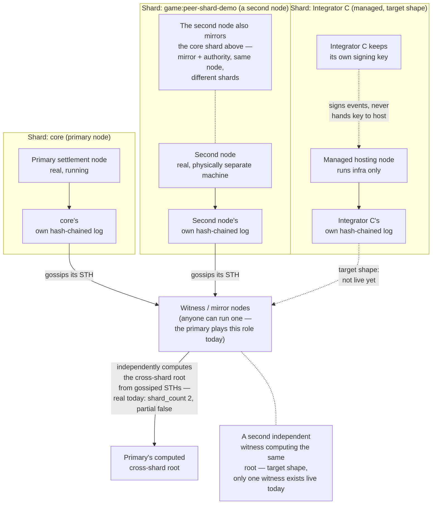
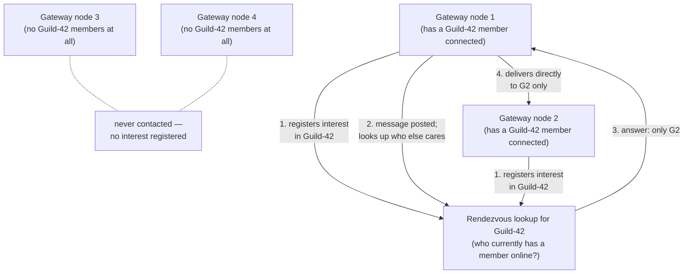

# Distributed Topology

Avalon separates two distributed problems, kept deliberately apart — the same
hot/durable split the rest of the architecture already uses ([overview.md](overview.md)):

1. **Settlement** — durable, infrequent, cryptographically verified facts.
   Sharded by *authority* (who's allowed to write it), not by load.
2. **Realtime** — frequent, ephemeral-to-warm, never cryptographically
   verified. Routed by *interest* (who's currently listening), not by
   authority.

They never share a mechanism. A node can run either, both, or neither.

Section 1 (Settlement) is real today, not just target shape: a genuine second
settlement shard runs on a physically separate machine, proving sharded authority,
cross-shard commitment, write routing, and per-shard trust anchors compose end to end
across real hardware, not just local processes sharing one Postgres — see each
section's own "current implementation" note below. Section 2 (Realtime) is real for
the guild-channel/conversation case, still evolving for presence and full-scale
discovery.

## 1. Settlement: sharded authority, no designated aggregator

- Each shard is authoritative for its own events only — one legitimate signer
  per shard, so there's still nothing to referee (the no-consensus reasoning
  is unchanged, just applied per-shard instead of network-wide).
- **No node "does the gluing."** The cross-shard root is a fixed, public
  recipe over gossiped shard STHs — any witness computes the identical
  result independently. Losing any one witness changes nothing; there is
  no privileged aggregator role to lose. Today only one witness (the
  primary) actually computes it live — the "no privileged aggregator"
  property is a design invariant of the recipe itself, not yet proven by
  running a second, independent witness that agrees.
- A shard operator can be the integrator itself, or a managed host running
  infrastructure on the integrator's behalf — the signing key never
  leaves the integrator either way (design-only, not the live shard
  above, which is self-hosted directly).
- A witness's check step above isn't just "does the math match" — it
  also confirms each contributing shard's STH is signed by a key actually
  authorized for that shard (see
  [`./network-trust-anchors.md`](./network-trust-anchors.md)'s "Per-shard
  trust anchors" section), catching a consistent-but-unauthorized shard,
  not just a math error. This check is real and live-verified, not
  simulated — a mirroring node's shard STH is resolved and checked against
  its actual DB-registered key.
- A single node can hold **both** roles at once for **different** shards —
  a mirroring node can mirror `core` while authoring its own shard. See
  [nodes.md](nodes.md)'s "A node's three configuration axes are
  independent" section.
- **A witness no longer needs to be told which shards exist in advance.**
  A witness with zero shards configured can learn a shard exists (and where
  to reach it) purely by being on the same bounded peer mesh a node already
  maintains, via the two-layer gossip design [`nodes.md`](nodes.md) and
  [`settlement.md`](settlement.md)'s "Automatic shard discovery" section
  describe — not a registry/directory node, not a change to who's
  authoritative or how trust is checked, only to how a witness finds out
  what to check in the first place.

## 2. Realtime: interest-scoped mesh, not full broadcast

- A node never needs a directory of every other node on the network — only
  how to reach the rendezvous lookup for a given guild/conversation, plus
  whichever peers it's actively exchanging events with right now.
- Delivery cost scales with how spread out *that guild* actually is, never
  with total network size — a network with millions of nodes and a guild
  with 5 online members costs the same as a small network with the same
  5 members.
- **A libp2p Kademlia DHT (`rust-libp2p`'s `kad` module) is the rendezvous
  lookup**, not a Redis-backed node per region or any other single-box
  design — the "avoids becoming a new single point of failure" requirement
  above is answered by kad's own replication (a record lives on the several
  nodes closest to its key, not one operator-chosen box), the
  production-proven approach IPFS/Filecoin/Ethereum already use for the same
  problem. A node's `PeerId`/bootstrap into the DHT (`crate::dht`) is real,
  live-verified across a multi-node LAN sandbox; registering/looking up
  interest itself (`crate::interest`, "registers interest"/"looks up who
  else cares" in the diagram above) is also real and live-verified —
  `crate::interest::run_worker` `PutRecord`s under a hash of the
  guild-channel/conversation id immediately on a scope's first local
  subscriber, then again every 45s for as long as one remains; a lookup
  is a `GetRecord` against that same key. **Wired into relay decisions**:
  `crate::realtime_relay::relay_to_peers` calls that lookup for
  channel/conversation events, which now only falls back to a full
  peer-table loop for presence (no channel/conversation scope exists to
  look up) and for any node with no DHT identity at all. Live-verified
  against two real, separately-running processes sharing one Postgres
  (`crates/server/tests/realtime_relay.rs`) with the DHT path actually
  exercised, not just the fallback path.
- The small-mesh degenerate case (a direct `POST /nodes/relay` to each
  resolved target) is now correctly narrowed by the DHT lookup above rather
  than being the *only* targeting mechanism.

## Overlay next-hop selection

Given a target node, `overlay_routing::next_hop(self, target, active_neighbors, visited)`
(a pure function in `crates/server/src/overlay_routing.rs`) picks where a node forwards:

1. If the target is an active neighbor, the next hop is the target itself.
2. Otherwise the unvisited active neighbor with the smallest XOR distance to the target,
   and only if it is strictly closer than the node itself, so every hop makes progress.
3. Otherwise `NoRoute`, with a reason (`TargetIsSelf`, `ForeignNetwork`, `NoNeighbors`,
   `AllVisited`, `NoProgress`).

Only nodes on the caller's own `network_id` are considered. The result is deterministic for
a given neighbor set, and the visited set plus strict progress rule rule out cycles.

Key derivation: when the node, the target and every candidate neighbor announce a libp2p
peer id, a node's key is `SHA-256(PeerId::to_bytes())`, the same key libp2p Kademlia uses
for its XOR metric, so overlay routing and DHT lookups agree on distance. If any of them
lacks a peer id, all nodes in that decision use `SHA-256` of the canonical `base_url`
(trimmed, trailing slashes removed, ASCII-lowercased) instead, so distances always come
from one key space.

This is the same key-space metric the DHT uses for interest lookups; the DHT resolves which nodes hold an interest, this rule chooses the neighbor to forward a request toward a named node.

## Current implementation

- Section 1: two independent settlement authorities exist today (the
  primary's `core` shard, and a second node's `game:...` shard), on two
  physically separate machines, with the primary computing a real
  cross-shard root over both. What's still missing versus the full target
  picture: only one witness exists (no second, independent witness has
  been stood up to *prove* agreement rather than just compute it once), and
  the managed-hosting shard (subgraph C above) is design-only. See
  [settlement.md](settlement.md) and [nodes.md](nodes.md) for the current
  state. Which shards a witness even knows to check is no longer purely
  config-based either — see [settlement.md](settlement.md)'s "Automatic
  shard discovery" section for the two-layer gossip mechanism, live-verified
  across three real, physically separate machines.
- Realtime fan-out is one in-process `tokio::broadcast` channel
  (`crates/server/src/presence.rs`/`crates/server/src/chat.rs`) fanned out
  cross-node by `crate::realtime_relay`, which resolves *who* to relay a
  channel/conversation event to via a real DHT interest lookup instead of a
  full peer-table loop — presence, which has no channel/conversation scope,
  and any node without a DHT identity still use the full-peer-table loop.
  That lookup also has an optional per-hoster Redis fast-path in front of
  it, reusing an existing optional Redis deployment — checked first, and
  only a same-fleet latency shortcut: an empty or failed Redis check falls
  straight through to the DHT exactly as if no fast path were configured at
  all, so it's never load-bearing for correctness. Section 2's
  interest-scoped mesh is real for the guild-channel/conversation case.
